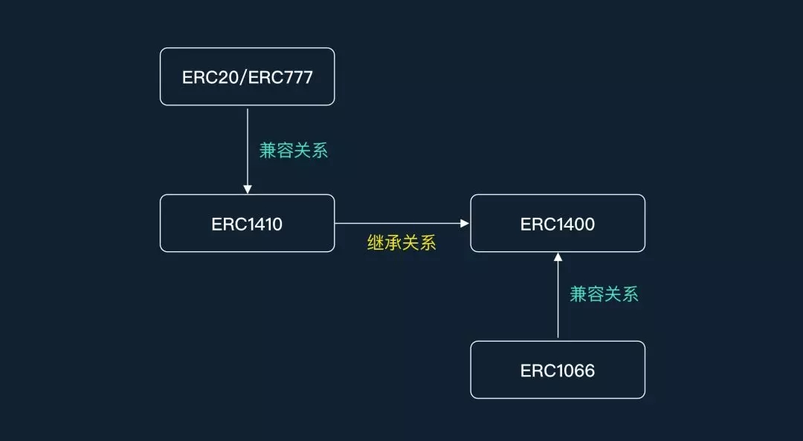

# Security Token Standard

证券型代币(Security Token)表示对资产的部分或完全所有权，公司、房地产甚至知识产权的股票，都可以用证券型代币来表示。证券型代币的好处，不仅适用于区块链融资，它还有可能改变传统的纸股范式，从而提高效率以及改善分配。例如，智能合约的很多应用，可以和证券型代币一起使用，以优化公司治理中的投票表决，提高其透明度。

<!-- more -->

# ERC1400

ERC1400 是证券通证标准，它是由 Gosselin, Adam Dossa, Pablo Ruiz, 以及 Fabian Vogelsteller 共同撰写的标准，其中 Gosselin 和 Dossa 是在 Polymath 工作。而 Ruiz 具有国际商业和金融方面的背景知识，而 Dossa 则是一名以太坊开发者和网页设计师。

根据标准作者指出，ERC1400 应该是和 ERC20 以及 ERC777 标准相兼容的，但是证券通证与功能型通证有很大的不同，并且需要链上以及链下参与者之间进行更复杂的交互，因此该 EIP 标准具有能力进行强制转移，目的是以防法律诉讼，并用于资金追回。此外，通证也必须是不可替换的（或者至少是「部分可替换的」），ERC1400 标准可以允许提供证券的各方，基于一组条件授予或拒绝交易。根据作者介绍，该通证标准需要用到 ERC1066。

ERC1400标准依赖于ERC1410标准，在设计上，将token的余额通过一个叫做分片（tranche）的属性，划分成不同的部分。

## ERC1410

ERC1410 通证标准是由 Adam Dossa、(@adamdossa), Pablo Ruiz (@pabloruiz55), Fabian Vogelsteller (@frozeman) 以及 Stephane Gosselin (@thegostep) 共同撰写的通证标准。

其标准名为：部分可替代通证标准（Partially Fungible Token Standard）。

ERC1410 需要用到 ERC777，该标准是 ERC777 的扩展，因此和 ERC20 以及 ERC777 是隐式兼容的。

## ERC777

ERC777 是 ERC20 的加强版，旨在加强用户的控制权限，具体有：

1. 随交易发送可以附带描述数据，以供某些业务场景使用

2. 设置一些转账限制，如黑名单

3. 支持一些高级交易

无论是 ERC20 还是 ERC777，每个单位的 Token 都是相同的，并无附加属性，属于 fungible token（同质化代币/可互换 Token）。ERC721标准的 Token，每个 Token 均有不同的ID，不同ID可以有不同的解释，属于 no-fungible token（非同质化 Token，不可互换 Token）

ERC1410标准的 Token 属于Partially-Fungible Token (部分可互换 Token )，将 ERC20/ERC777 中不存在解释属性的余额，附加额外的信息，从而划分成不同的部分，就可以做一些操作上的限制（例如：某些操作只限定于指定 tranche 的 Token，某些操作优先消耗指定tranche的 Token）

## EIPs之间的关系

# Implement

## ERC1400

getDocument;
setDocument;
isControllable;
isIssuable;
issueByPartition;
redeemByPartition;
operatorRedeemByPartition;
canTransferByPartition;
canOperatorTransferByPartition;

### ERC1410

balanceOfByPartition;
partitionOf;
transferByPartition;
operatorTransferByPartition;
getDefaultPartitions;
setDefaultPartitions;
controllersByPartition;
authorizeOperatorByPartition;
revokeOperatorByPartition;
isOperatorForPartition;

#### ERC777

name;
symbol;
totalSupply;
balanceOf;
granularity;
controllers;
authorizeOperator;
revokeOperator;
isOperatorFor;
transferWithData;
transferFromWithData;
redeem;
redeemFrom;

- SafeMath
- Ownable
- ReentrancyGuard
- ERC1820Client
- CertificateController
- IERC777TokensSender
- IERC777TokensRecipient

### MinterRole

# Reference

1. [Security Token（证券型代币）标准——ERC1400,ERC1404,ST-20,R-Token的对比](https://www.jianshu.com/p/da778c4b0031)
2. [ERC-1400: Security Token Standard](https://github.com/ethereum/EIPs/issues/1400)
3. [ERC-1400: Evolution of a Security Token Standard](https://blog.polymath.network/erc-1400-evolution-of-a-security-token-standard-1e25d12b9261)
4. [ERC-1400 doc](https://docs.google.com/presentation/d/e/2PACX-1vS6pUx-VjdwSfELQwFVlXzq3Ekvxa9wpGTrNJqkp6-CnHxBPecjTEcVq21V6Nsbc-Bp4yq4dZTtp6Kn/pub?start=false&loop=false&delayms=3000&slide=id.g594e042d60_2_165)