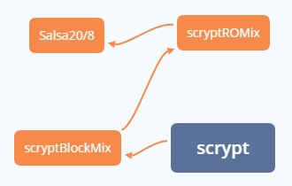

scrpyt算法是由著名的FreeBSD黑客 Colin Percival为他的备份服务 Tarsnap开发的，当初的设计是为了降低CPU负荷，尽量少的依赖cpu计算，利用CPU闲置时间进行计算，因此scrypt不仅计算所需时间长，而且占用的内存也多，使得并行计算多个摘要异常困难，因此利用rainbow table进行暴力攻击更加困难。scrypt没有在生产环境中大规模应用，并且缺乏仔细的审察和广泛的函数库支持。所以scrpyt一直没有推广开，但是由于其内存依赖的设计特别符合当时对抗专业矿机的设计，成为数字货币算法发展的一个主要应用方向。

<!-- more -->

scrypt算法最早被用于的数字货币是Tenebrix，之后被莱特币使用，旨在减少攻击者通过使用定制的并行电路分解（break）基于密码的密钥推导函数而获得的优势，它提高了对内存的依赖性，降低并行运算效率。

先看一下scrypt算法与内部相关函数的关系：



接下来，从调用角度，从里到外介绍scrypt算法涉及的相应函数。

# Salsa20/8

```C
#define R(a,b) (((a) << (b)) | ((a) >> (32 - (b))))
void salsa20_word_specification(uint32 out[16],uint32 in[16])
{
    int i;
    uint32 x[16];
    for (i = 0;i < 16;++i) x[i] = in[i];
    for (i = 8;i > 0;i -= 2) {
        x[ 4] ^= R(x[ 0]+x[12], 7); x[ 8] ^= R(x[ 4]+x[ 0], 9);
        x[12] ^= R(x[ 8]+x[ 4],13); x[ 0] ^= R(x[12]+x[ 8],18);
        x[ 9] ^= R(x[ 5]+x[ 1], 7); x[13] ^= R(x[ 9]+x[ 5], 9);
        x[ 1] ^= R(x[13]+x[ 9],13); x[ 5] ^= R(x[ 1]+x[13],18);
        x[14] ^= R(x[10]+x[ 6], 7); x[ 2] ^= R(x[14]+x[10], 9);
        x[ 6] ^= R(x[ 2]+x[14],13); x[10] ^= R(x[ 6]+x[ 2],18);
        x[ 3] ^= R(x[15]+x[11], 7); x[ 7] ^= R(x[ 3]+x[15], 9);
        x[11] ^= R(x[ 7]+x[ 3],13); x[15] ^= R(x[11]+x[ 7],18);
        x[ 1] ^= R(x[ 0]+x[ 3], 7); x[ 2] ^= R(x[ 1]+x[ 0], 9);
        x[ 3] ^= R(x[ 2]+x[ 1],13); x[ 0] ^= R(x[ 3]+x[ 2],18);
        x[ 6] ^= R(x[ 5]+x[ 4], 7); x[ 7] ^= R(x[ 6]+x[ 5], 9);
        x[ 4] ^= R(x[ 7]+x[ 6],13); x[ 5] ^= R(x[ 4]+x[ 7],18);
        x[11] ^= R(x[10]+x[ 9], 7); x[ 8] ^= R(x[11]+x[10], 9);
        x[ 9] ^= R(x[ 8]+x[11],13); x[10] ^= R(x[ 9]+x[ 8],18);
        x[12] ^= R(x[15]+x[14], 7); x[13] ^= R(x[12]+x[15], 9);
        x[14] ^= R(x[13]+x[12],13); x[15] ^= R(x[14]+x[13],18);
    }
    for (i = 0;i < 16;++i) out[i] = x[i] + in[i];
}
```

**Salsa20**是一种[流加密](https://zh.wikipedia.org/wiki/流加密)算法，由[丹尼尔·J·伯恩斯坦](https://zh.wikipedia.org/w/index.php?title=丹尼尔·J·伯恩斯坦&action=edit&redlink=1)提交到[eSTREAM](https://zh.wikipedia.org/w/index.php?title=ESTREAM&action=edit&redlink=1)。它创建在基于add-rotate-xor（ARX）操作的[伪随机](https://zh.wikipedia.org/wiki/伪随机)函数之上——32位模加、[异或](https://zh.wikipedia.org/wiki/异或)（XOR）和[循环移位操作](https://zh.wikipedia.org/wiki/位操作)。Salsa20映射一个256[位](https://zh.wikipedia.org/wiki/位元)密钥、一个64位[nonce](https://zh.wikipedia.org/wiki/Nonce)以及一个64位流位置到一个512位的输出（也存在一个128位密钥的版本）。这使Salsa20具有了不同寻常的优势，用户可以在恒定时间内寻求输出流中的任何位置。它可以在现代[x86](https://zh.wikipedia.org/wiki/X86)处理器中提供约每4–14次循环周期一字节的速度，并具有合理的硬件性能。它没有注册专利，并且Bernstein还撰写了几篇对常见[架构](https://zh.wikipedia.org/wiki/架构)优化的[公有领域](https://zh.wikipedia.org/wiki/公有领域)实现。

而Salsa20/8是将轮数减少到8轮的Salsa20算法，从64字节的字符串散列到64字节的字符串。注意它不是加密哈希函数，它不能避免冲突。

# scryptBlockMix

```
   Input:
            B[0] || B[1] || ... || B[2 * r - 1]
                   Input octet string (of size 128 * r octets),
                   treated as 2 * r 64-octet blocks,
                   where each element in B is a 64-octet block.

   Output:
            B'[0] || B'[1] || ... || B'[2 * r - 1]
                   Output octet string.

   Steps:

     1. X = B[2 * r - 1]

     2. for i = 0 to 2 * r - 1 do
          T = X xor B[i]
          X = Salsa (T)
          Y[i] = X
        end for

     3. B' = (Y[0], Y[2], ..., Y[2 * r - 2],
              Y[1], Y[3], ..., Y[2 * r - 1])
```

将块打乱混合，用Salsa20/8作为hash函数。

# scryptROMix

```
   Input:
            r       Block size parameter.
            B       Input octet vector of length 128 * r octets.
            N       CPU/Memory cost parameter, must be larger than 1,
                    a power of 2, and less than 2^(128 * r / 8).

   Output:
            B'      Output octet vector of length 128 * r octets.

   Steps:

     1. X = B

     2. for i = 0 to N - 1 do	//N次循环  
          V[i] = X
          X = scryptBlockMix (X)
        end for

     3. for i = 0 to N - 1 do
          j = Integerify (X) mod N
                 where Integerify (B[0] ... B[2 * r - 1]) is defined
                 as the result of interpreting B[2 * r - 1] as a
                 little-endian integer.
          T = X xor V[j]
          X = scryptBlockMix (T)
        end for

     4. B' = X
```

Integerify是一个映射函数，创造伪随机序列。N次循环调用scryptBlockMix进行散列。

# scrypt

```
   Input:
            P       Passphrase, an octet string.
            S       Salt, an octet string.
            N       CPU/Memory cost parameter, must be larger than 1,
                    a power of 2, and less than 2^(128 * r / 8).
            r       Block size parameter.
            p       Parallelization parameter, a positive integer
                    less than or equal to ((2^32-1) * hLen) / MFLen
                    where hLen is 32 and MFlen is 128 * r.
            dkLen   Intended output length in octets of the derived
                    key; a positive integer less than or equal to
                    (2^32 - 1) * hLen where hLen is 32.

   Output:
            DK      Derived key, of length dkLen octets.

   Steps:

    1. Initialize an array B consisting of p blocks of 128 * r octets
       each:
        B[0] || B[1] || ... || B[p - 1] = PBKDF2-HMAC-SHA256 (P, S, 1, p * 128 * r)

    2. for i = 0 to p - 1 do
          B[i] = scryptROMix (r, B[i], N)
        end for

    3. DK = PBKDF2-HMAC-SHA256 (P, B[0] || B[1] || ... || B[p - 1], 1, dkLen)
```

PBKDF2简单而言就是将salted hash进行多次重复计算，这个次数是可选择的。如果计算一次所需要的时间是1微秒，那么计算1百万次就需要1秒钟。假如攻击一个密码所需的rainbow table有1千万条，建立所对应的rainbow table所需要的时间就是115天。这个代价足以让大部分的攻击者忘而生畏。

根据密码和设置的参数用PBKDF2-HMAC-SHA256生成一个itstream，将其用scryptROMix计算得到新的itstream。然后新的itstream和密码再次用PBKDF2-HMAC-SHA256计算得到derived key。

# Refer

[如何生成安全的密码 Hash：MD5, SHA, PBKDF2, BCrypt 示例](https://www.cnblogs.com/interdrp/p/4935819.html)

[scrypt - Tarsnap](https://www.tarsnap.com/scrypt/scrypt-slides.pdf)