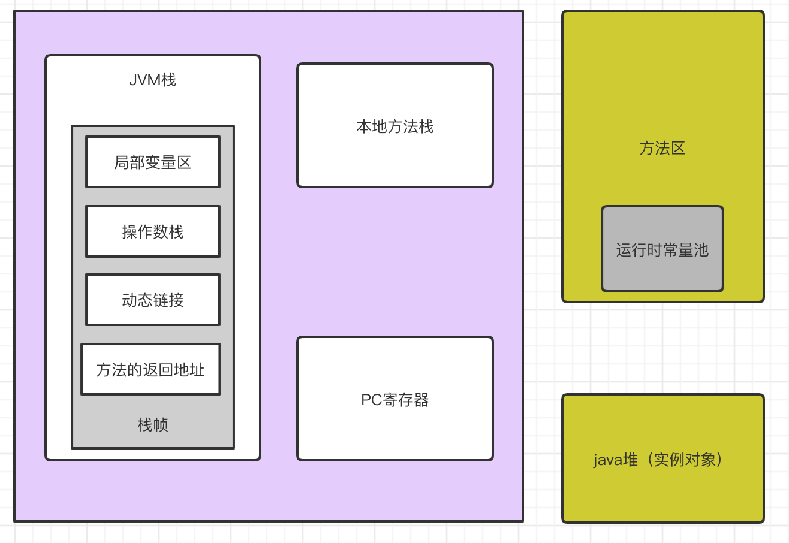
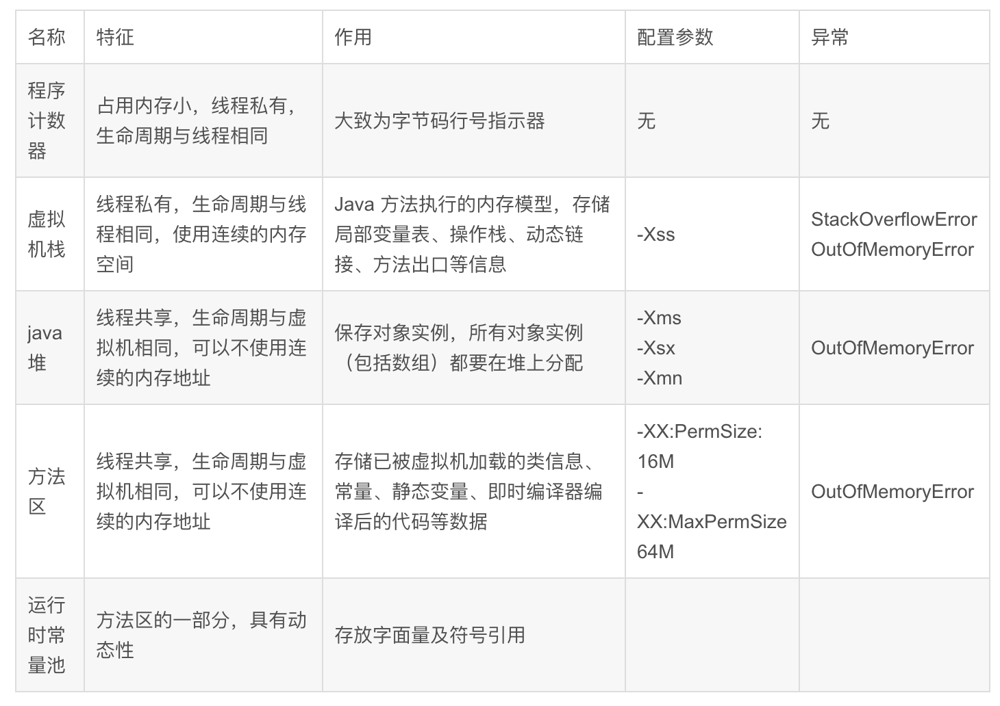
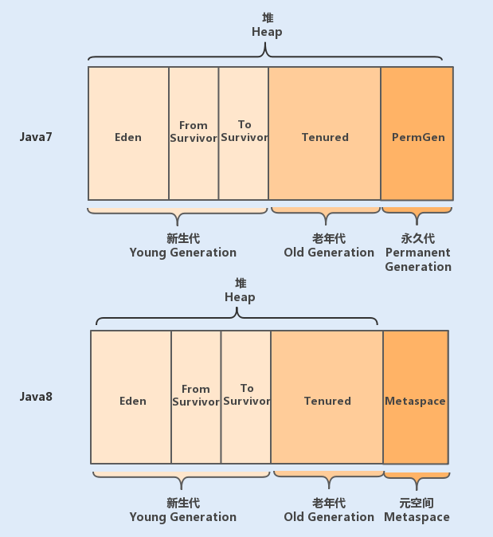
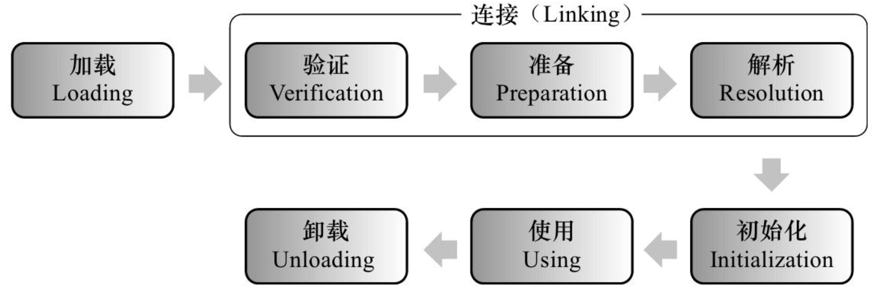

# 修饰用法

## 基本用法

一般用来修饰成员变量或函数，可以在没有创建对象的情况下来进行调用。

## 修饰类

普通类是不允许声明为静态的，只有内部类才可以。

## 修饰函数/方法

修饰方法的时候，其实跟类一样，可以直接通过类名来进行调用。

## 修饰变量

被static修饰的成员变量叫做静态变量，也叫做类变量，说明这个变量是属于这个类的，而不是属于是对象，没有被static修饰的成员变量叫做实例变量，说明这个变量是属于某个具体的对象的。

## 修饰代码块

静态代码块在类第一次被载入时执行，类初始化的顺序如下：

父类静态变量、父类静态代码块、子类静态变量、子类静态代码块、父类普通变量、父类普通代码块、父类构造函数、子类普通变量、子类普通代码块、子类构造函数。

# 内存结构分析

## Java程序执行流程

运行时数据区，是常说的JVM内存。因此，在Java中我们常常说到的内存管理就是针对这段空间进行管理（如何分配和回收内存空间）。

## 运行时数据区

#### 方法区

方法区又叫静态区，跟堆一样，被所有的线程共享。方法区包含所有的class和static变量。方法区中包含的都是在整个程序中永远唯一的元素。**主要是用来存放已被虚拟机加载的类相关信息**，包括类信息、运行时常量池、字符串常量池。类信息又包括了类的版本、字段、方法、接口和父类等信息。

方法区是**java虚拟机规范去中定义的一种概念上的区域（不是具体空间，可以在堆上，也可以在本地内存里）**，具有什么功能，但并没有规定这个区域到底应该位于何处，因此对于实现者来说，如何来实际方法区是有着很大自由度的。

永生代是hotspot中的一个概念，其他jvm实现未必有，例如jrockit就没这东西。java8之前，hotspot使用在内存中划分出一块区域来存储类的元信息、类变量以及内部字符串（interned string）等内容，称之为永生代，把它作为方法区来使用。

JEP122提议取消永生代，方法区作为概念上的区域仍然存在。原先永生代中类的元信息会被放入本地内存（元数据区，metaspace），将类的静态变量和内部字符串放入到java堆中。

##### PermGen(永久代)

绝大部分Java程序员应该都见过“java.lang.OutOfMemoryError: PremGen space”异常。这里的“PermGen space”其实指的就是方法区。不过方法区和“PermGen space”又有着本质的区别。前者是JVM的规范，而后者则是JVM规范的一种实现，并且只有HotSpot才有“PermGen space”，而对于其他类型的虚拟机，如JRockit(Oracle)、J9(IBM)并没有“PermGen space”。由于方法区主要存储类的相关信息，所以对于动态生成类的情况比较容易出现永久代的内存溢出。并且JDK 1.8中参数PermSize和MaxPermSize已经失效。

##### 元空间

其实，移除永久代的工作从JDK 1.7就开始了。JDK 1.7中，存储在永久代的部分数据就已经转移到Java Heap或者Native Heap。但永久代仍存在于JDK 1.7中，并没有完全移除，譬如符号引用(Symbols)转移到了native heap；字面量(interned strings)转移到了Java heap；类的静态变量(class statics)转移到了Java heap。

JDK1.8对JVM架构的改造将类元数据放到本地内存中，另外，将常量池和静态变量放到Java堆里。HotSpot VM将会为类的元数据明确分配和释放本地内存。在这种架构下，类元信息就突破了原来-XX:MaxPermSize的限制，现在可以使用更多的本地内存。 **这样就从一定程度上解决了原来在运行时生成大量类造成经常Full GC问题，如运行时使用反射、代理等。所以升级以后Java堆空间可能会增加。**

元空间的本质和永久代类似，都是对JVM规范中方法区的实现。不过元空间与永久代之间的最大区别在于：元空间并不在虚拟机中，而是使用本地内存。因此，默认情况下，元空间的大小仅受本地内存限制，但可以通过以下参数指定元空间的大小：

> -XX:MetaspaceSize，初始空间大小，达到该值就会触发垃圾收集进行类型卸载，同时GC会对改值进行调整：如果释放了大量的空间，就适当降低该值；如果释放了很少的空间，那么在不超过MaxMetaspaceSize时，适当提高该值。
>
> -XX:MaxMetaspaceSize，最大空间，默认是没有限制的。

除了上面的两个指定大小的选项外，还有两个与GC相关的属性：

> -XX:MinMetaspaceFreeRatio，在GC之后，最小的Metaspace剩余空间容量的百分比，减少为分配空间所导致的垃圾收集。
>
> -XX:MaxMetaspaceFreeRatio，在GC之后，最大的Metaspace剩余空间容量的百分比，减少为释放空间所导致的垃圾收集。 

所以对于方法区，Java8之后的变化：

移除了永久代（PermGen），替换为元空间（Metaspace）；
永久代中的 class metadata 转移到了 native memory（本地内存，而不是虚拟机）；
***永久代中的 interned Strings 和 class static variables 转移到了 Java heap；(方法区和堆存在了交集)***
永久代参数 （PermSize MaxPermSize） -> 元空间参数（MetaspaceSize MaxMetaspaceSize）

堆被划分为新生代和老年代，新生代又被进一步划分为 Eden 和 Survivor 区，最后 Survivor 由 From Survivor 和 To Survivor 组成。

#### 虚拟机栈（VM stack）

每一个运行在Java虚拟机里的线程都拥有自己的线程栈。这个线程栈包含了这个线程调用的方法当前执行点相关的信息。一个线程仅能访问自己的线程栈。一个线程创建的本地变量对其它线程不可见，仅自己可见。即使两个线程执行同样的代码，这两个线程任然在在自己的线程栈中的代码来创建本地变量。因此，每个线程拥有每个本地变量的独有版本。

所有原始类型的本地变量都存放在线程栈上，因此对其它线程不可见。一个线程可能向另一个线程传递一个原始类型变量的拷贝，但是它不能共享这个原始类型变量自身。每个线程包含一个栈区，栈中只保存基础数据类型的对象和自定义对象的引用(不是对象)，对象都存放在堆区中。

栈分为3个部分：基本类型变量区、执行环境上下文、操作指令区(存放操作指令)。

每一个方法的调用都伴随着栈帧的入栈操作，方法的返回则是栈帧的出栈操作。

#### 本地方法栈（Native Method Stack）

本地方法栈跟 Java 虚拟机栈的功能类似，Java 虚拟机栈用于管理 Java 函数的调用，而本地方法栈则用于管理本地方法的调用。但本地方法并不是用 Java 实现的，而是由 C 语言实现的。

#### 堆

堆上包含在Java程序中创建的所有对象，无论是哪一个对象创建的。这包括原始类型的对象版本。如果一个对象被创建然后赋值给一个局部变量，或者用来作为另一个对象的成员变量，这个对象任然是存放在堆上。

存储的全部是对象，每个对象都包含一个与之对应的class的信息。(class的目的是得到操作指令)。

jvm只有一个堆区(heap)被所有线程共享，堆中不存放基本类型和对象引用，只存放对象本身。

##### 举例

一个本地变量可能是原始类型，在这种情况下，它总是“呆在”线程栈上。

一个本地变量也可能是指向一个对象的一个引用。在这种情况下，引用（这个本地变量）存放在线程栈上，但是对象本身存放在堆上。

一个对象可能包含方法，这些方法可能包含本地变量。这些本地变量任然存放在线程栈上，即使这些方法所属的对象存放在堆上。

一个对象的成员变量可能随着这个对象自身存放在堆上。不管这个成员变量是原始类型还是引用类型。

静态成员变量跟随着类定义一起也存放在堆上。

存放在堆上的对象可以被所有持有对这个对象引用的线程访问。当一个线程可以访问一个对象时，它也可以访问这个对象的成员变量。如果两个线程同时调用同一个对象上的同一个方法，它们将会都访问这个对象的成员变量，但是每一个线程都拥有这个本地变量的私有拷贝。

#### 程序计数器（Program Counter Register）

程序计数器是一块很小的内存空间，主要用来记录各个线程执行的字节码的地址，例如，分支、循环、跳转、异常、线程恢复等都依赖于计数器。

由于 Java 是多线程语言，当执行的线程数量超过 CPU 数量时，线程之间会根据时间片轮询争夺 CPU 资源。如果一个线程的时间片用完了，或者是其它原因导致这个线程的 CPU 资源被提前抢夺，那么这个退出的线程就需要单独的一个程序计数器，来记录下一条运行的指令。

## 注意事项

1、静态方法只能访问静态成员。（非静态既可以访问静态，又可以访问非静态）

2、静态方法中不可以使用this或者super关键字。

3、主函数是静态的

# 静态方法访问限制

静态方法和静态变量是属于某一个类，而不属于类的对象。

## 类加载的生命周期

### 加载（loading）

”加载“是”类加机制”的第一个过程，在加载阶段，虚拟机主要完成三件事：

（1）通过一个类的全限定名来获取其定义的二进制字节流

（2）将这个字节流所代表的的静态存储结构转化为方法区的运行时数据结构

（3）在堆中生成一个代表这个类的Class对象，作为方法区中这些数据的访问入口。

**注意此时会扫描到我们的代码中是否有静态变量或者是静态方法等等这些静态数据结构，还未分配内存。**

### 验证（verification）

确保 Class 文件的字节流中包含的信息符合当前虚拟机的要求，并且不会危害虚拟机自身的安全。

### 准备（preparation）

**准备阶段主要为类变量分配内存并设置初始值**。这些内存都在方法区分配。注意此时就会为我们的类变量也就是静态变量分配内存，但是普通成员变量还没。

### 解析（resolution）

解析阶段主要是虚拟机将常量池中的符号引用转化为直接引用的过程。引用方式：继承、实现接口、域变量、方法定义、方法中定义的本地变量。

符号引用：一个 java 文件会编译成一个class文件。在编译时，java 类并不知道所引用的类的实际地址，因此只能使用符号引用来代替。

直接引用：直接指向目标的指针（指向方法区，Class 对象）、指向相对偏移量（指向堆区，Class 实例对象）或指向能间接定位到目标的句柄。

### 初始化（initialization）

这是类加载机制的最后一步，在这个阶段，java程序代码才开始真正执行。我们知道，在准备阶段已经为类变量赋过一次值。在初始化阶端，程序员可以根据自己的需求来赋值了。**初始化时候才会为我们的普通成员变量赋值。**

### 结论

静态方法是属于类的，动态方法属于实例对象，在类加载的时候就会分配内存，可以通过类名直接去访问，非静态成员（变量和方法）属于类的对象，所以只有该对象初始化之后才存在，然后通过类的对象去访问。

也就是说如果我们在静态方法中调用非静态成员变量会超前，可能会调用了一个还未初始化的变量。因此编译器会报错。

