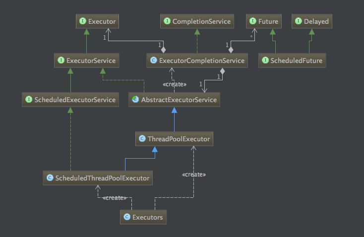
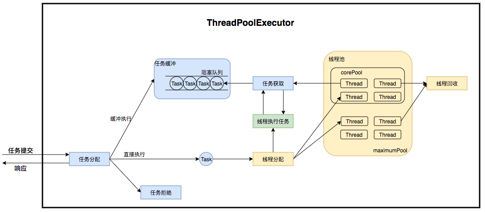
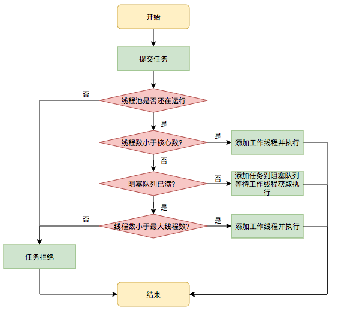
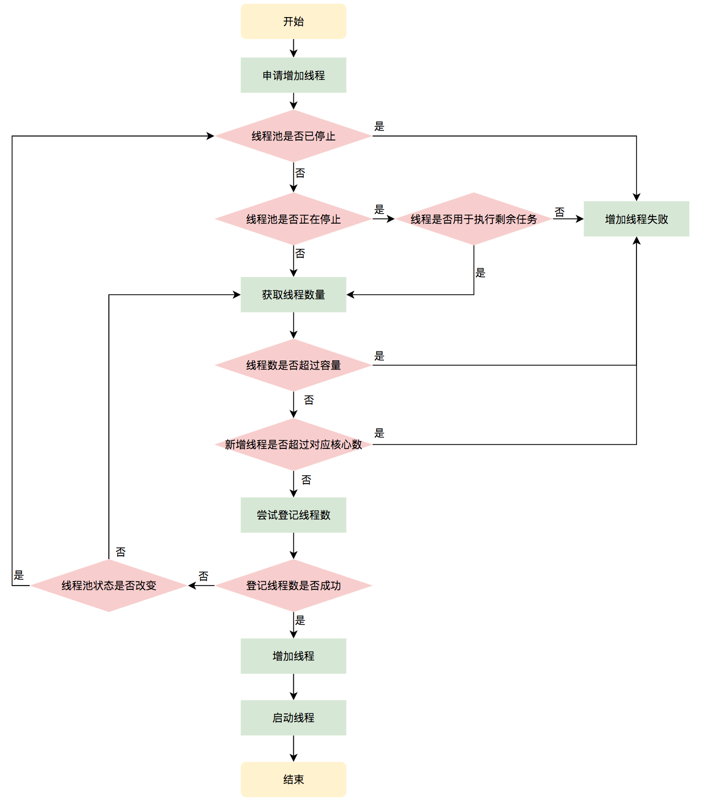
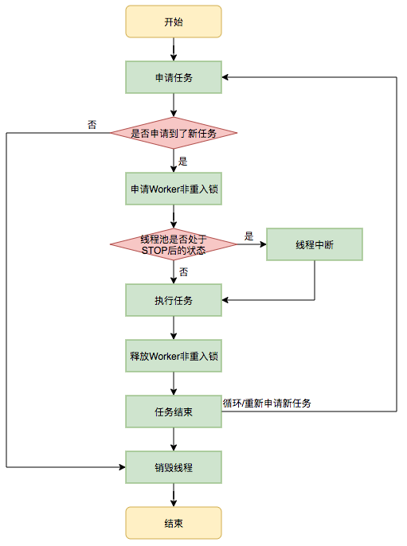

# **线程池 ( ThreadPoolExecutor)**

- 线程池是为了避免线程频繁的创建和销毁带来的性能消耗，而建立的一种池化技术，它是把已创建的线程放入“池”中，当有任务来临时就可以重用已有的线程，无需等待创建的过程，这样就可以有效提高程序的响应速度

<!-- more-->

​	

## 构造函数

```java
public ThreadPoolExecutor(int corePoolSize,
                          int maximumPoolSize,
                          long keepAliveTime,
                          TimeUnit unit,
                          BlockingQueue<Runnable> workQueue,
                          ThreadFactory threadFactory,
                          RejectedExecutionHandler handler) {

  ......
}
```


1. `corePoolSize `表示线程池的常驻核心线程数。如果设置为 0，则表示在没有任何任务时，销毁线程池；如果大于 0，即使没有任务时也会保证线程池的线程数量等于此值。但需要注意，此值如果设置的比较小，则会频繁的创建和销毁线程；如果设置的比较大，则会浪费系统资源，所以开发者需要根据自己的实际业务来调整此值

2. `maximumPoolSize `表示线程池在任务最多时，最大可以创建的线程数。官方规定此值必须大于 0，也必须大于等于 `corePoolSize`，此值只有在任务比较多，且不能存放在任务队列时，才会用到

3. `keepAliveTime` 表示线程的存活时间，当线程池空闲时并且超过了此时间，多余的线程就会销毁，直到线程池中的线程数量销毁到等于` corePoolSize` 为止，如果 `maximumPoolSize` 等于 `corePoolSize`，那么线程池在空闲的时候也不会销毁任何线程

4. `unit `表示存活时间的单位，它是配合 `keepAliveTime `参数共同使用的

5. `workQueue `表示线程池执行的任务队列，当线程池的所有线程都在处理任务时，如果来了新任务就会缓存到此任务队列中排队等待执行

6. `threadFactory` 表示线程的创建工厂，此参数一般用的比较少，我们通常在创建线程池时不指定此参数，它会使用默认的线程创建工厂的方法来创建线程:

   ```java
   // 默认的线程创建工厂，需要实现 ThreadFactory 接口
   static class DefaultThreadFactory implements ThreadFactory {
       private static final AtomicInteger poolNumber = new AtomicInteger(1);
       private final ThreadGroup group;
       private final AtomicInteger threadNumber = new AtomicInteger(1);
       private final String namePrefix;
   
       DefaultThreadFactory() {
           SecurityManager s = System.getSecurityManager();
           group = (s != null) ? s.getThreadGroup() :
                                 Thread.currentThread().getThreadGroup();
           namePrefix = "pool-" +
                         poolNumber.getAndIncrement() +
                        "-thread-";
       }
       // 创建线程
       public Thread newThread(Runnable r) {
           Thread t = new Thread(group, r,
                                 namePrefix + threadNumber.getAndIncrement(),
                                 0);
           if (t.isDaemon()) 
               t.setDaemon(false); // 创建一个非守护线程
           if (t.getPriority() != Thread.NORM_PRIORITY)
               t.setPriority(Thread.NORM_PRIORITY); // 线程优先级设置为默认值
           return t;
       }
   }
   ```

7. `RejectedExecutionHandler` 表示指定线程池的拒绝策略，当线程池的任务已经在缓存队列` workQueue` 中存储满了之后，并且不能创建新的线程来执行此任务时，就会用到此拒绝策略，它属于一种限流保护的机制

8. `ctl`：控制状态的属性

   ```java
   private final AtomicInteger ctl = new AtomicInteger(ctlOf(RUNNING, 0));
   private static final int COUNT_BITS = Integer.SIZE - 3;
   private static final int CAPACITY   = (1 << COUNT_BITS) - 1;
   
   // runState is stored in the high-order bits
   private static final int RUNNING    = -1 << COUNT_BITS;
   private static final int SHUTDOWN   =  0 << COUNT_BITS;
   private static final int STOP       =  1 << COUNT_BITS;
   private static final int TIDYING    =  2 << COUNT_BITS;
   private static final int TERMINATED =  3 << COUNT_BITS;
   
   // Packing and unpacking ctl
   private static int runStateOf(int c)     { return c & ~CAPACITY; }
   private static int workerCountOf(int c)  { return c & CAPACITY; }
   private static int ctlOf(int rs, int wc) { return rs | wc; }
   ```

   - 用一个 AtomicInteger 包装两个字段:

     * 高 3 位保存 runState，低 29 位保存 workerCount

     - 用一个变量去存储两个值，可避免在做相关决策时，出现不一致的情况，不必为了维护两者的一致，而占用锁资源

     - workerCount: 有效线程数

     - runState: 线程池的运行状态

       * 定义
         * **RUNNING**: 接受新任务并处理排队的任务
         * **SHUTDOWN**: 拒绝接受新任务, 但是会处理还在排队的任务
         * **STOP**: 拒绝接受新任务, 也不处理排队中任务, 并且会中断正在执行的任务
         * **TIDYING**: 所有任务都已经停止, workerCount 为 0, 转换为状态 **TIDYING** 的线程将运行 terminated() 方法
         * **TERMINATED**: terminated() 执行完毕

       - 这些值之间的数字顺序很重要，可以进行有序的比较

       - runState 随着时间逐步增加，但不一定达到每个状态, 过渡的顺序为:

       - - **RUNNING** -> **SHUTDOWN**, 在调用` shutdown()` 时，可能隐藏在` finalize()` 中调用
         - (**RUNNING** or **SHUTDOWN**) -> **STOP**, 在调用 `shutdownNow() `时
         - **SHUTDOWN** -> **TIDYING**, 当队列和池子内的任务都为空时
         - **STOP** -> **TIDYING**, 当池子内的任务为空时
         - **TIDYING** -> **TERMINATED**, 当 terminated() 执行完毕时

       - 线程在 `awaitTermination() `中等待, 将在状态变为 **TERMINATED** 时返回

# 线程数量

线程不是越多越好！

1. 线程在java中是一个对象，更是操作系统的资源，创建、销毁需要消耗资源；
2. 线程过多，会消耗很多的内存；
3. 操作系统需要频繁切换线程上下文，影响性能。

## 如何确定数量

计算型任务：cpu数量的1-2倍；
IO型任务：根据具体的IO阻塞时长考虑

# 工作流程



## API
* 接口Executor：定义了执行任务的`execute()`；
* 接口ExecutorService：继承了接口Executor，拓展了Callable、Future、关闭方法；
* 接口ScheduledExecutorService：继承了接口ExecutorService，增加了定时任务相关方法；
* 实现类ThreadPoolExecutor：基础、标准的线程池实现；
* 实现类ScheduledThreadPoolExecutor：继承了实现类ThreadPoolExecutor，实现了ScheduledExecutorService中相关定时任务的方法。

创建一个核心线程数量5，最大数量10，加开线程存活5秒，等待队列3的线程池，最大容纳13个任务：`new ThreadPoolExecutor(5, 10, 5, TimeUnit.SECONDS,new LinkedBlockingQueue<Runnable>(3));`

## execute

```java
public void execute(Runnable command) {
    if (command == null)
        throw new NullPointerException();
    int c = ctl.get();
    // 当前工作的线程数小于核心线程数
    if (workerCountOf(c) < corePoolSize) {
        // 创建新的线程执行此任务
        if (addWorker(command, true))
            return;
        c = ctl.get();
    }
    // 检查线程池是否处于运行状态，如果是则把任务添加到队列
    if (isRunning(c) && workQueue.offer(command)) {
        int recheck = ctl.get();
        // 再次检查线程池是否处于运行状态，防止在第一次校验通过后线程池关闭
        // 如果是非运行状态，则将刚加入队列的任务移除
        if (! isRunning(recheck) && remove(command))
            reject(command);
        // 如果线程池的线程数为 0 时（当 corePoolSize 设置为 0 时会发生）
        else if (workerCountOf(recheck) == 0)
            addWorker(null, false); // 新建线程执行任务
    }
    // 核心线程都在忙且队列都已爆满，尝试新启动一个线程执行失败
    // addWorker(Runnable firstTask, boolean core),core为false时比较maximumPoolSize
    else if (!addWorker(command, false)) 
        // 执行拒绝策略
        reject(command);
}
```

1. 是否达到核心线程数量？没达到，创建一个工作线程来执行任务；
2. 工作队列是否已经满？没满，则将新提交的任务存储到队列；
3. 是否达到线程池最大数量？没达到，则创建一个新的工作线程来执行任务（加开的线程如果没有任务会自动销毁）；
4. 最后，拒绝执行。



### addWorker

- `firstTask`，线程应首先运行的任务，如果没有则可以设置为 null

- `core`，判断是否可以创建线程的阀值（最大值），如果等于 true 则表示使用 corePoolSize 作为阀值，false 则表示使用 maximumPoolSize 作为阀值

- ```java
  private boolean addWorker(Runnable firstTask, boolean core) {
    retry:
    for (;;) {
      int c = ctl.get();
      int rs = runStateOf(c);
  
      if (rs >= SHUTDOWN && // 线程池是否已停止
          ! (rs == SHUTDOWN && // 线程池是否正在停止
             firstTask == null && ! workQueue.isEmpty()) // 线程是否用于执行剩余任务
         )
        return false;
  
      for (;;) {
        int wc = workerCountOf(c);
        if (wc >= CAPACITY || // 线程数是否超过容量
            wc >= (core ? corePoolSize : maximumPoolSize)) // 是否超过判断的阀值
          return false;
        if (compareAndIncrementWorkerCount(c)) // CAS 尝试登记线程数
          break retry; // 登记成功
        c = ctl.get();  // Re-read ctl
        if (runStateOf(c) != rs) // 判断线程池状态运行过程中是否有改变
          continue retry;
        // else CAS failed due to workerCount change; retry inner loop
      }
    }
  
    boolean workerStarted = false;
    boolean workerAdded = false;
    Worker w = null;
    try {
      w = new Worker(firstTask);
      final Thread t = w.thread;
      if (t != null) {
        final ReentrantLock mainLock = this.mainLock;
        mainLock.lock();
        try {
          // Recheck while holding lock.
          // Back out on ThreadFactory failure or if
          // shut down before lock acquired.
          int rs = runStateOf(ctl.get());
  
          if (rs < SHUTDOWN ||
              (rs == SHUTDOWN && firstTask == null)) {
            if (t.isAlive()) // precheck that t is startable
              throw new IllegalThreadStateException();
            workers.add(w); // 持有引用
            int s = workers.size();
            if (s > largestPoolSize)
              largestPoolSize = s; // 更新创建过的最大线程数
            workerAdded = true;
          }
        } finally {
          mainLock.unlock();
        }
        if (workerAdded) {
          t.start(); // 启动线程, 而线程的 run 方法就是执行 runWorker()
          workerStarted = true;
        }
      }
    } finally {
      if (! workerStarted)
        addWorkerFailed(w);
    }
    return workerStarted;
  }
  ```



## Worker

### 构造函数

```java
private final class Worker extends AbstractQueuedSynchronizer implements Runnable{
    final Thread thread; // Worker 持有的线程
    Runnable firstTask; // 初始化的任务，可以为 null
  
  Worker(Runnable firstTask) {
    setState(-1); // inhibit interrupts until runWorker
    this.firstTask = firstTask;
    this.thread = getThreadFactory().newThread(this);
  }
  
  ......
}
```

### runWorker

```java
final void runWorker(Worker w) {
    Thread wt = Thread.currentThread();
    // 获取第一个任务
    Runnable task = w.firstTask;
    w.firstTask = null;
    // 允许中断
    w.unlock(); // allow interrupts
    // 是否因为异常退出循环
    boolean completedAbruptly = true;
    try {
        // 如果task为空，则通过getTask来获取任务
        while (task != null || (task = getTask()) != null) {
            w.lock();
            // If pool is stopping, ensure thread is interrupted;
            // if not, ensure thread is not interrupted.  This
            // requires a recheck in second case to deal with
            // shutdownNow race while clearing interrupt
            // 如果线程池正在停止，那么要保证当前线程是中断状态，否则要保证当前线程不是中断状态
            if ((runStateAtLeast(ctl.get(), STOP) ||
                 (Thread.interrupted() &&
                  runStateAtLeast(ctl.get(), STOP))) &&
                !wt.isInterrupted())
                wt.interrupt();
            try {
                beforeExecute(wt, task);
                Throwable thrown = null;
                try {
                    task.run();
                } catch (RuntimeException x) {
                    thrown = x; throw x;
                } catch (Error x) {
                    thrown = x; throw x;
                } catch (Throwable x) {
                    thrown = x; throw new Error(x);
                } finally {
                    afterExecute(task, thrown);
                }
            } finally {
                task = null;
                w.completedTasks++;
                w.unlock();
            }
        }
        completedAbruptly = false;
    } finally {
        processWorkerExit(w, completedAbruptly);
    }
}
```




#### getTask

```java
private Runnable getTask() {
    // timeOut 表示上次从阻塞队列中取任务时是否超时
    boolean timedOut = false; // Did the last poll() time out?

    for (;;) {
        int c = ctl.get();
        int rs = runStateOf(c);

        // Check if queue empty only if necessary.
        /*
         * 1. 线程池已经 stop
         * 2. 线程池处于 shutdown 并且队列为空
         * 如果以上任何条件满足，则将 workerCount 减 1 并返回 null
         */
        if (rs >= SHUTDOWN && (rs >= STOP || workQueue.isEmpty())) {
            decrementWorkerCount();
            return null;
        }

        int wc = workerCountOf(c);

        // Are workers subject to culling?
        // timed 用于判断是否需要进行超时控制
        // allowCoreThreadTimeOut 默认是 false，也就是核心线程不允许进行超时
        // wc > corePoolSize，表示当前线程池中的线程数量大于核心线程数量
        // 对于超过核心线程数量的这些线程，需要进行超时控制
        boolean timed = allowCoreThreadTimeOut || wc > corePoolSize;

        /*
         * wc > maximumPoolSize 是因为可能通过 setMaximumPoolSize 修改过 maximumPoolSize
         * timed && timedOut 如果为 true，表示当前操作需要进行超时控制，并且上次从阻塞队列中获取任务发生了超时
         * 接下来判断，如果有效线程数量大于 1，或者阻塞队列是空的，那么尝试将 workerCount 减 1
         * 如果减 1 失败，则返回重试
         */
        if ((wc > maximumPoolSize || (timed && timedOut))
            && (wc > 1 || workQueue.isEmpty())) {
            if (compareAndDecrementWorkerCount(c))
                return null;
            continue;
        }

        try {
            /*
             * 根据 timed 来判断，如果为 true，则通过阻塞队列的 poll 方法进行超时控制
             * 如果在 keepAliveTime 时间内没有获取到任务，则返回 null
             * 否则通过 take 方法，如果这时队列为空，则 take 方法会阻塞直到队列不为空。
             * 
             */
            Runnable r = timed ?
                workQueue.poll(keepAliveTime, TimeUnit.NANOSECONDS) :
                workQueue.take();
            if (r != null)
                return r;
            // 如果 r == null，说明已经超时，timedOut 设置为 true
            timedOut = true;
        } catch (InterruptedException retry) {
            // 如果获取任务时当前线程发生了中断，则设置 timedOut 为 false 并返回循环重试
            timedOut = false;
        }
    }
}
```


### **继承 AQS 原因分析**

Worker 是通过继承 AQS，使用 AQS 来实现独占锁这个功能。没有使用可重入锁 ReentrantLock，而是使用 AQS，为的就是实现**不可重入**的特性去反应线程现在的执行状态

1. lock 方法一旦获取了独占锁，表示当前线程正在执行任务中
2. 如果正在执行任务，则不应该中断线程
3. 如果该线程现在不是独占锁的状态，也就是空闲的状态，说明它没有在处理任务，这时可以对该线程进行中断
4. 线程池在执行 shutdown 方法或 tryTerminate 方法时会调用 interruptIdleWorkers 方法来中断空闲的线程，interruptIdleWorkers 方法会使用 tryLock 方法来判断线程池中的线程是否是空闲状态；如果线程是空闲状态则可以安全回收
5. 之所以设置为不可重入，是因为我们不希望任务在调用像 setCorePoolSize 这样的线程池控制方法时重新获取锁。如果使用 ReentrantLock，它是可重入的，这样如果在任务中调用了如 setCorePoolSize 这类线程池控制的方法，会中断正在运行的线程。

* setCorePoolSize方法：

```java
public void setCorePoolSize(int corePoolSize) {
    if (corePoolSize < 0)
        throw new IllegalArgumentException();
    int delta = corePoolSize - this.corePoolSize;
    this.corePoolSize = corePoolSize;
    if (workerCountOf(ctl.get()) > corePoolSize)
        interruptIdleWorkers();
    else if (delta > 0) {
        // We don't really know how many new threads are "needed".
        // As a heuristic, prestart enough new workers (up to new
        // core size) to handle the current number of tasks in
        // queue, but stop if queue becomes empty while doing so.
        int k = Math.min(delta, workQueue.size());
        while (k-- > 0 && addWorker(null, true)) {
            if (workQueue.isEmpty())
                break;
        }
    }
}
```

* interruptIdleWorkers

```java
private void interruptIdleWorkers(boolean onlyOne) {
    final ReentrantLock mainLock = this.mainLock;
    mainLock.lock();
    try {
        for (Worker w : workers) {
            Thread t = w.thread;
            if (!t.isInterrupted() && w.tryLock()) {
                try {
                    t.interrupt();
                } catch (SecurityException ignore) {
                } finally {
                    w.unlock();
                }
            }
            if (onlyOne)
                break;
        }
    } finally {
        mainLock.unlock();
    }
}
```

如果允许重入，`w.tryLock()`为`true`，线程就把自己打断了。

- 此外，在构造方法中执行了setState(-1);，把 state 变量设置为 -1，是因为 AQS 默认的 state 是0，如果刚创建了一个 Worker 对象，还没有执行任务时，这时就不应该被中断：

  ```java
  protected boolean tryAcquire(int unused) {
    if (compareAndSetState(0, 1)) {
      setExclusiveOwnerThread(Thread.currentThread());
      return true;
    }
    return false;
  }
  
  protected boolean tryRelease(int unused) {
    setExclusiveOwnerThread(null);
    setState(0);
    return true;
  }
  ```

  * tryAcquire 方法是根据 state 是否是 0 来判断的，所以，`setState(-1); `将 state 设置为 -1 是为了禁止在执行任务前对线程进行中断
  * 在 runWorker 方法中会先调用 Worker 对象的 unlock 方法将 state 设置为 0, 允许中断和 lock

### 相关参数

```java
// 用于操作 workers 
private final ReentrantLock mainLock = new ReentrantLock();

// 持有线程的引用, 管理线程的生命周期
private final HashSet<Worker> workers = new HashSet<Worker>();

// 用于通知线程
private final Condition termination = mainLock.newCondition();

// 线程池曾经创建过的最大线程数量
private int largestPoolSize;

// 线程池已经执行的和未执行的任务总数
private long completedTaskCount;
```

- 为什么workers使用HashSet和ReentraintLock而不使用并发的set ?
  * 简化了统计数据，比如说将 worker 添加到 workers 后还需要判断是否需要更新 largestPoolSize 等，workers 只在获取到 mainLock 的情况下才会进行读写
  * mainLock 也用于在中断线程`interruptIdleWorkers`的时候串行执行，否则可能会并发进行线程中断，引起不必要的中断高峰。否则退出中的线程会并发地中断那些还没有被中断的线程。

## 停止
shutdown：不接收新任务，等待任务执行结束；
shutdownNow：立即结束所有线程，队列中线程不再执行，不接收新任务，返回未结束任务列表（队列中的）。

```java
public void shutdown() {
    final ReentrantLock mainLock = this.mainLock;
    mainLock.lock();
    try {
        // 安全策略判断
        checkShutdownAccess();
        // 切换状态为 SHUTDOWN
        advanceRunState(SHUTDOWN);
        // 中断空闲线程
        interruptIdleWorkers();
        onShutdown(); // hook for ScheduledThreadPoolExecutor
    } finally {
        mainLock.unlock();
    }
    // 尝试结束线程池
    tryTerminate();
}

public List<Runnable> shutdownNow() {
    List<Runnable> tasks;
    final ReentrantLock mainLock = this.mainLock;
    mainLock.lock();
    try {
        checkShutdownAccess();
        // 设置状态为 STOP
        advanceRunState(STOP);
        // 中断所有工作线程
        interruptWorkers();
        // 取出队列中没有被执行的任务
        tasks = drainQueue();
    } finally {
        mainLock.unlock();
    }
    tryTerminate();
    return tasks;
}
```

## 回收

### processWorkerExit

- 线程池中线程的销毁依赖 JVM 的垃圾回收，当线程池决定哪些线程需要回收时，只需要将其引用消除即可
- Worker 被创建出来后，就会不断地进行轮询，然后获取任务去执行，核心线程可以无限等待获取任务，非核心线程要限时获取任务
- 当 Worker 无法获取到任务，也就是获取的任务为空时，循环会结束，Worker 会主动消除自身在线程池内的引用
- 线程回收的工作在 processWorkerExit 方法内完成

```java
private void processWorkerExit(Worker w, boolean completedAbruptly) {
    // 如果 completedAbruptly 值为 true，则说明线程执行时出现了异常，需要将 workerCount 减 1
    // 如果线程执行时没有出现异常，说明在 getTask() 方法中已经已经对 workerCount 进行了减 1 操作
    if (completedAbruptly) // If abrupt, then workerCount wasn't adjusted
        decrementWorkerCount();

    final ReentrantLock mainLock = this.mainLock;
    mainLock.lock();
    try {
        // 统计完成的任务数
        completedTaskCount += w.completedTasks;
        // 从 workers 中移除，也就表示着从线程池中移除了一个工作线程
        workers.remove(w);
    } finally {
        mainLock.unlock();
    }

    // 根据线程池状态进行判断是否结束线程池
    tryTerminate();

    int c = ctl.get();
    /*
     * 当线程池是 RUNNING 或 SHUTDOWN 状态时，如果 worker 是异常结束，那么会直接 addWorker；
     * 如果 allowCoreThreadTimeOut 为 true，并且等待队列有任务，至少保留一个 worker；
     * 如果 allowCoreThreadTimeOut 为 false，workerCount 不少于 corePoolSize。
     */
    if (runStateLessThan(c, STOP)) {
        if (!completedAbruptly) {
        int min = allowCoreThreadTimeOut ? 0 : corePoolSize;
            if (min == 0 && ! workQueue.isEmpty())
              min = 1;
            if (workerCountOf(c) >= min)
                return; // replacement not needed
        }
        addWorker(null, false);
    }
}
```

### tryTerminate : 根据状态判断是否结束

```java
final void tryTerminate() {
    for (;;) {
        int c = ctl.get();
        /*
         * 当前线程池的状态为以下几种情况时，直接返回：
         * 1. RUNNING，因为还在运行中，不能停止
         * 2. TIDYING 或 TERMINATED，因为线程池中已经没有正在运行的线程了
         * 3. SHUTDOWN 并且等待队列非空，这时要执行完 workQueue 中的 task；
         */
        if (isRunning(c) ||
            runStateAtLeast(c, TIDYING) ||
            (runStateOf(c) == SHUTDOWN && ! workQueue.isEmpty()))
            return;
        // 如果线程数量不为 0，则中断一个空闲的工作线程，并返回
        if (workerCountOf(c) != 0) { // Eligible to terminate
            interruptIdleWorkers(ONLY_ONE);
            return;
        }

        final ReentrantLock mainLock = this.mainLock;
        mainLock.lock();
        try {
            // 判断到这个位置则说明线程数量为 0 并且等待队列为空
            // 尝试设置状态为 TIDYING，如果成功则调用 terminated 方法
            if (ctl.compareAndSet(c, ctlOf(TIDYING, 0))) {
                try {
                    // terminated 方法默认什么都不做，留给子类实现
                    terminated();
                } finally {
                    // 设置状态为 TERMINATED
                    ctl.set(ctlOf(TERMINATED, 0));
                    termination.signalAll();
                }
                return;
            }
        } finally {
            mainLock.unlock();
        }
        // else retry on failed CAS
        // 没设置成功则继续 CAS 尝试
    }
}
```


## schedule

* scheduleAtFixedRate：如果执行时间大于周期时间，在上一个任务执行完毕后，立即执行下一个；
* scheduleWithFixedDelay：如果执行时间大于周期时间，在上一次完毕后，再重新计时。

## 相关问题

### **ThreadPoolExecutor 的执行方法有几种？它们有什么区别？**

* `execute()` VS `submit()`

  * 都是用来执行线程池任务，它们最主要的区别是 `submit() `方法可以接收线程池执行的返回值，而 `execute()` 不能接收返回值

  * ```java
    ThreadPoolExecutor executor = new ThreadPoolExecutor(2, 10, 10L,
            TimeUnit.SECONDS, new LinkedBlockingQueue(20));
    // execute 使用
    executor.execute(new Runnable() {
        @Override
        public void run() {
            System.out.println("Hello, execute.");
        }
    });
    // submit 使用
    Future<String> future = executor.submit(new Callable<String>() {
        @Override
        public String call() throws Exception {
            System.out.println("Hello, submit.");
            return "Success";
        }
    });
    System.out.println(future.get());
    ```

  * `execute()` 方法属于 `Executor` 接口的方法，而 `submit() `方法则是属于 `ExecutorService` 接口的方法

  * 在 `submit() `中处理的任务如果抛出异常, 只有在调用返回的 `Future `对象 `get `方法时才会抛出

### **拒绝策略的分类有哪些? 如何自定义拒绝策略？**

* 自带的拒绝策略有 4 种:

  * **AbortPolicy**，终止策略，线程池会抛出异常并终止执行，它是**默认**的拒绝策略
  * **CallerRunsPolicy**，把任务交给当前线程来执行
  * **DiscardPolicy**，忽略此任务（最新的任务）
  * **DiscardOldestPolicy**，忽略最早的任务（最先加入队列的任务）

* 自定义拒绝策略

  * 自定义拒绝策略只需要新建一个` RejectedExecutionHandler` 对象，然后重写它的 `rejectedExecution() `方法即可

  ```java
  ThreadPoolExecutor executor = new ThreadPoolExecutor(1, 3, 10,
          TimeUnit.SECONDS, new LinkedBlockingQueue<>(2),
          new RejectedExecutionHandler() {  // 添加自定义拒绝策略
              @Override
              public void rejectedExecution(Runnable r, ThreadPoolExecutor executor) {
                  // 业务处理方法
                  System.out.println("执行自定义拒绝策略");
              }
          });
  for (int i = 0; i < 6; i++) {
      executor.execute(() -> {
          System.out.println(Thread.currentThread().getName());
      });
  }
  ```

### **线程池的工作队列有哪些?**

* ArrayBlockingQueue, 是一个用数组实现的**有界**阻塞队列，按 FIFO 排序任务, 支持公平锁和非公平锁
* LinkedBlockingQueue, 基于链表结构的阻塞队列，按 FIFO 排序任务，容量可以选择进行设置，不设置的话，将是一个无边界的阻塞队列，最大长度为 Integer.MAX_VALUE，吞吐量通常要高于 ArrayBlockingQuene
* DelayQueue, 是一个任务定时周期的延迟执行的队列。根据指定的执行时间从小到大排序，否则根据插入到队列的先后排序
* PriorityBlockingQueue, 是具有优先级的**无界**阻塞队列, 不能保证同优先级元素的顺序
* SynchronousQueue, 一个不存储元素的阻塞队列，每个插入操作必须等到另一个线程调用移除操作，否则插入操作一直处于阻塞状态，吞吐量通常要高于 LinkedBlockingQueue
* SynchronousQueue, 一个不存储元素的阻塞队列，每个插入操作必须等到另一个线程调用移除操作，否则插入操作一直处于阻塞状态，吞吐量通常要高于 LinkedBlockingQueue
* LinkedBlockingDeque, 一个由链表结构组成的双向阻塞队列，队列头尾都可以插入和移除元素, 多线程并发时, 可以将锁的竞争最多 降到一半

### **ThreadPoolExecutor 如何实现扩展？**

* 通过重写` beforeExecute() `和 `afterExecute() `方法，我们可以在扩展方法中添加日志或者实现数据统计，比如统计线程的执行时间

### **关于 Executors 内的线程池对象**

* Executors 源码中`Executors.newFixedThreadPool()`、`Executors.newSingleThreadExecutor() `和 `Executors.newCachedThreadPool() `等方法的底层都是通过 `ThreadPoolExecutor`实现的
  * `FixedThreadPool` (固定数目线程的线程池)
    * 适用于处理 CPU 密集型的任务，确保 CPU 在长期被工作线程使用的情况下，尽可能的少的分配线程
    * 特点
      * 核心线程数和最大线程数大小一样
      * keepAliveTime 为 0
      * 阻塞队列为 LinkedBlockingQueue
  * CachedThreadPool (可缓存线程的线程池)
    * 适用于并发执行大量短期的小任务
    * 特点
      * 核心线程数为 0
      * 最大线程数为 Integer.MAX_VALUE
      * 阻塞队列为 SynchronousQueue
      * 非核心线程空闲存活时间为 60 秒
  * SingleThreadExecutor (单线程的线程池)
    * 适用于串行执行任务的场景，一个任务一个任务地执行
    * 特点
      * 核心线程数为 1
      * 最大线程数也为 1
      * 阻塞队列是 LinkedBlockingQueue
      * keepAliveTime 为 0
  * ScheduledThreadPool (定时及周期执行的线程池)
    * 周期性执行任务的场景，需要限制线程数量的场景
    * 特点
      * 最大线程数为 Integer.MAX_VALUE
      * 阻塞队列是 DelayedWorkQueue
      * keepAliveTime 为 0
      * scheduleAtFixedRate() 按某种速率周期执行
      * scheduleWithFixedDelay() 在某个延迟后执行
* 在阿里巴巴的《 Java 开发手册 》中是这样规定的：
  * 线程池不允许使用` Executors `去创建，而是通过` ThreadPoolExecutor` 的方式，这样的处理方式让写的读者更加明确线程池的运行规则，规避资源耗尽的风险。
  * `Executors` 返回的线程池对象的弊端如下：
    * `FixedThreadPool` 和 `SingleThreadPool`：允许的请求队列长度为` Integer.MAX_VALUE`，可能会堆积大量的请求，从而导致 OOM
    * `CachedThreadPool` 和 `ScheduledThreadPool`：允许的创建线程数量为 `Integer.MAX_VALUE`，可能会创建大量的线程，从而导致 OOM

# Reference

[Chanson's blog：Java-线程与线程池](https://chansonchan.cn/2020/05/20/Java-线程与线程池/#more)

