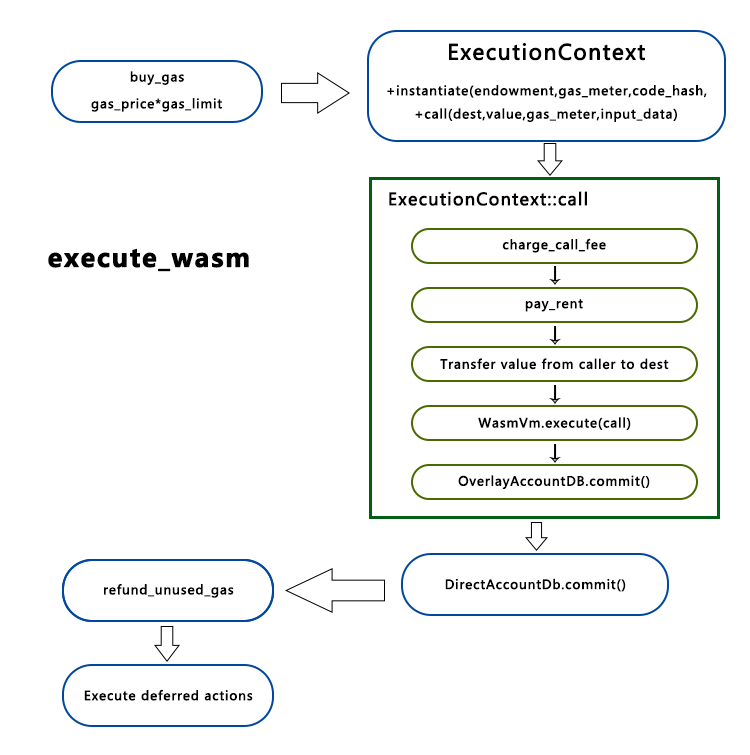

 基本概念，substrate 合约与以太坊合约的一些联系与区别，上传合约代码 `put_code` 和实例化合约 `instantiate` 两个外部接口的实现。ChainX团队的这篇文章已经阐述过了： https://www.jianshu.com/p/ad1320ef9904 

本文将介绍合约模块的第三个外部接口合约调用 `call` 的基本逻辑，并且会详细介绍下 substrate 关于合约收费的设计。   

<!-- more -->

# `call` ：调用合约

首先是调用了账户查找`lookup`，返回给`dest`的是`AccountId`。

接着主要是调用了`bare_call`这个函数，和`instantiate`一样走得是`execute_wasm`。`ctx.call`实际上调用的是  `ExecutionContext::call`。



在`ExecutionContext::call`中，首先判断了调用深度，然后收取调用合约的gas费用，接着调用`pay_rent`收取存储空间的租用费用。代码在 `srml/contracts/src/rent.rs`，`try_evict`和`pay_rent`都是走`try_evict_or_and_pay_rent`。该函数涉及费用计算，因此在**合约收费**中介绍。支付`rent`费用后，若合约状态变更为`tomestone`，则直接返回错误信息。

如果`value`不为0的话，会调用`transfer`将`value`传给`dest`账户（不一定是合约账户 ）。

然后调用`nested.overlay.get_code_hash(account)`得到合约账户对应的合约哈希，根据`dest_code_hash`执行合约。`nested.loader.load_main(&dest_code_hash)`会得到包含合约的调用接口`call`的`executable`：`load_main`调用了`load_code`，它会比较 schedule 的版本，之前在 `put_code`的最后是写入了两个存储，一个是原始代码，一个是原始代码预处理后的 `prefab_module`。如果当前版本大于已经预处理好的版本， 那么需要重新预处理，否则直接返回已经存储的 `prefab_module`。`load_init` 最终返回 `WasmExecutable` 结构体 `executable`。 

然后与合约部署时一样，将返回的 `executable`放到 `WasmVm` 执行 `execute`。通过`call`执行完相应函数后，进行合约账户的余额检查，如果低于账户存在的最小额，将合约删除。   

如果一切顺利，`OverlayAccountDb` 进行 `commit`并且将延迟操作存入`nested.deferred`中。注意这里还没有正式写入存储。回到最外层的 `execute_wasm`，如果这里执行正确，`DirectAccountDb` 进行 `commit`，这里才是真正写到存储里面。然后又是正常的返回剩余 `Gas`，和执行延后的 `runtime`调用等等。

# 合约收费

## 存储收费

设计到存储收费的主要是在`srml/contracts/src/rent.rs`中的`try_evict_or_and_pay_rent`函数。

在`instantiate`时，我们传入了`endowment`这个值，令合约账户中拥有资产。根据合约账户的`balance`大小，可以根据`RentDepositOffset`计算得到一个免费的存储空间大小。计算公式为`free_storage = balance / RentDepositOffset`。

而如果合约大小超过了这个免费空间，那么需要按`RentByteFee`收费，该值的单位为每块每字节。所以需要支付的租用费用计算公式为：

`rent = effective_storage_size(超过的空间) * RentByteFee * blocks_passed(距离上一次支付)`。
可见，如果一个合约资产不足以完全存储合约代码，随着时间的流逝，最终它的资产会减少到无法维持`Alive`状态，从而变更为`Tombstone`，甚至被直接删除（太久未被调用）。这是一个合理的设计，使得`runtime`中不会存储太多合约，存储空间得到充分利用。

在我们`instantiate_contract`时，默认设置`rent_allowance`为`balance`能支持的最大值。该值会随着每次支付`rent`而逐渐减少。所以实际上，设置`rent_allowance`这个值也可以限制合约需要的资产门槛。

状态为`tombstone`的合约，在后面可以用状态为`Alive`的合约`retore_to`进行替换。注意，当合约状态变更为`tombstone`时，合约数据已经被删除，所以用该方法对依赖数据的合约进行更新是不可行的。

## 操作的gas费用

写在开头：所有的`gas`费用，在操作调用一开始，就根据两者（操作时传入的`gas_limit`和链设定的`gas_price`）的乘积，从发起交易者的账户中收取了，然后存在`gas_meter`这个gas“管家”中。当操作完成时，剩余的gas会调用`refund_unused_gas(...)`进行返还。

接下来对不同的操作，进行gas费用收取的剖析：

1. `instantiate`：根据`schedule`中设定的`instantiate_base_cost`。

   ```rust
   impl<T: Trait> Token<T> for ExecFeeToken {
   	type Metadata = Config<T>;
   	#[inline]
   	fn calculate_amount(&self, metadata: &Config<T>) -> Gas {
   		match *self {
   			ExecFeeToken::Call => metadata.schedule.call_base_cost,
   			ExecFeeToken::Instantiate => metadata.schedule.instantiate_base_cost,
   		}
   	}
   }
   gas_meter.charge(self.config, ExecFeeToken::Instantiate)
   ```

   

2. `call`：根据`schedule`中设定的`call_base_cost`。

   ```rust
   gas_meter.charge(self.config, ExecFeeToken::Call)
   ```

   

3. `transfer`：对不同的`transfer_kind`有不同的收取标准。费用标准在`Config`中设定，编写链的时候在`impl contracts::Trait for Runtime{...}`时写入相应的值。

   ```rust
   impl<T: Trait> Token<T> for TransferFeeToken<BalanceOf<T>> {
   	type Metadata = Config<T>;
   
   	#[inline]
   	fn calculate_amount(&self, metadata: &Config<T>) -> Gas {
   		let balance_fee = match self.kind {
   			TransferFeeKind::ContractInstantiate => metadata.contract_account_instantiate_fee,
   			TransferFeeKind::AccountCreate => metadata.account_create_fee,
   			TransferFeeKind::Transfer => metadata.transfer_fee,
   		};
   		approx_gas_for_balance(self.gas_price, balance_fee)
   	}
   }
   // 对不同操作进行gas收费
   if gas_meter.charge(ctx.config, token).is_out_of_gas() {
   	return Err("not enough gas to pay transfer fee");
   }
   ```

| Cause                      | 收取标准                         |
| :------------------------- | -------------------------------- |
| 部署合约（`Instantiate`）  | contract_account_instantiate_fee |
| `Call`时，`dest`账户不存在 | account_create_fee               |
| `Call`时，合约账户存在     | transfer_fee                     |

注意，`Instantiate`和`Call`时创建的账户是不同的，`Instantiate`创建的是合约账户，`Call`创建的是普通账户。

另外，在`instantiate`和`call`中，都会调用`transfer`。