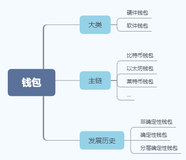

# 钱包简介

钱包的定义：存储加密数字货币的软件程序；

关键：安全方便地生成、保存和备份/恢复密钥。

# 钱包分类

# 钱包发展历史

## 非确定性（随机）钱包

1. 钱包生成私钥，私钥之间没有任何关系，都是独立的；
2. 安全性，资产不放到一个篮子里；
3. 带来了麻烦，私钥都要保存、备份，导入导出也麻烦。

## 确定性（种子）钱包

1. 引入了种子的概念；
2. 解决了非确定钱包存储和备份的麻烦，一个种子搞定；
3. 一个种子能恢复所有的私钥。

## 分层确定性钱包（HD钱包）

1. HD钱包（BIP-32）的全文：hierarchical Deterministic ；
2. 私钥的衍生结构是树状结构，父密钥可以衍生一系列子密钥；子密钥又可以衍生孙密钥，无限衍生；
3. 引入了助记词概念（BIP-39），只要记住助记词就行了。

### 生成助记词

使用BIP-39中定义的标准化过程，钱包自动生成助记词。钱包从一个熵源开始，添加一个校验和，然后将熵映射到一个单词列表:

1. 创建128到256位的随机序列（熵）。
2. 通过获取SHA256哈希的第一（熵长度/ 32）位来创建随机序列的校验和。
3. 将校验和添加到随机序列的末尾。
4. 将序列分成11位的部分。
5. 将每个11位值映射到来自2048个单词的预定义字典中的单词。
6. 助记词是单词序列。

| 熵（bits） | Checksum（bits） | 熵+Checksum（bits） | 助记词长度（words） |
| :--------: | :--------------: | :-----------------: | :-----------------: |
|    128     |        4         |         132         |         12          |
|    160     |        5         |         165         |         15          |
|    192     |        6         |         198         |         18          |
|    224     |        7         |         231         |         21          |
|    256     |        8         |         264         |         24          |

# 备份方式

除了私钥和之前提到的助记词方式，还有文件的方式。

# Refer

[《精通以太坊》-钱包](https://www.jianshu.com/p/9c5af78453f4)